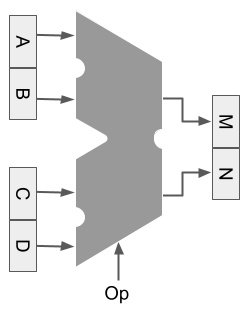

   

# TinySPU -- Tiny Spatial Processing Unit

The TinySPU is a prototypical Spatial Processing Unit (SPU) that implements core spatial calculations in hardware. In short, this project designed the world's first tiny GIS on a computer chip. To achieve this feat, we created a 4-bit processor that supports raster, vector, and AI operations. The technical terms and jargon-rich way to say this is that the TinySPU is an application-specific integrated circuit for spatial application (a spatial ASIC) or a domain-specific architecture for spatial processing. And it is open! The design and code use an open-source license. 

It was initially designed for the TinyTapeout project; check out our story below. Due to the 'tiny' nature of the design, the processor is limited to expressing 16 numbers (0000-1111 in binary or 0-15 in decimal). So, 16 spatial operations (spatial ops) are available. We developed a 'test bench' that tests the operations to ensure they function correctly. We also created a 'demo bench' that uses TinySPU spatial operations to implement multiple classic GIS and geospatial methods. This project is a prototype. So expect further improvements and refinements as we get feedback from the community.

Enough with the explanation. Let's see how it works and why it is different.

## Structure of TinySPU

The TinySPU takes 4 integer inputs: A, B, C, D. It generates 2 integer outputs: M, N. It also takes in an opcode: Op. 
(Yes, we designed it to be ABCD and MNoP, and we added the 'MN' to shout out to the University of Minnesota). 
The 4 ins and 2 outs design feature is unique compared to the classic [Arithmetic Logic Unit (ALU)](https://en.wikipedia.org/wiki/Arithmetic_logic_unit), designed with 2 inputs and 1 output (e.g., 1+1 = 2). 
Our processor is purposefully designed for spatial processing, as shown below.

Our design enables the TinySPU to process 2 points (y1,x1) and (y2,x2) or 4 cells in a raster row. In doing so, we can incorporate optimizations for spatial operations in the processor's hardware. For example, when calculating FocalMeanRow, overlapping calculations can be eliminated in hardware, saving energy and improving performance. How does an SPU work on TinyTapeout? Well, for that information, read our [technical documentation](docs/info.md). 

How do you program a SPU? With a spatial instruction set architecture (SISA), of course! See our 16 opcodes with examples and documentation in the table below. 

## Operations - A Spatial Instruction Set

| Opcode | Mnemonic | Description |
|--------|---------|-----------|
| `0000` | [NOP](#0000-nop) | No Operation does nothing. |
| `0001` | [MinGate](#0001-mingate) | Search for minimum value, output min value and index location. |
| `0010` | [EqGate](#0010-eqgate) | Search for exact value, output value and index location, if found |
| `0011` | [ZeroMN](#0011-zeromn) | Output 0 for M and N. |
| `0100` | [DistDir](#0100-distdir) | Computes the Manhattan Distance (M) and direction (N). |
| `0101` | [VectorBoxArea](#0101-vectorboxarea) | Compute area (M) and perimeter (N). |
| `0110` | [BasicBuffer](#0110-basicbuffer) | Add a buffer distance to a line segment. |
| `0111` | [AttrReclass](#0111-attrreclass) | Reclassifies values into up to 3 classes. |
| `1000` | [FocalMeanRow](#1000-focalmeanrow) | Computes the mean of 3 values across a row (ABC for M, BCD for N) |
| `1001` | [FocalSumRow](#1001-focalsumrow) | Computes the sum of 3 values across a row (ABC for M, BCD for N) |
| `1010` | [LocalDiv](#1010-localdiv) | Divides values in pairs (M = A/C, N = B/D) |
| `1011` | [FocalMaxPoolRow](#1011-focalmaxpoolrow) | Partial calculation for MaxPool (used in geoAI; M = max(A,B), N = max(C,D)) |
| `1100` | [NormDiffIndex](#1100-normdiffindex) | Computes the normalized difference index. |
| `1101` | [LocalCodeOp](#1101-localcodeop) | Applies bitwise or arithmetic operations. |
| `1110` | [MHDist8](#1110-mhdist8) | Computes the Manhattan Distance with higher precision. |
| `1111` | [DotProduct](#1111-dotproduct) | Computes the dot product with sum accumulation (used in geoAI). |

## The beginning... GIS on chips.

TinySPU is the start. It is not the end. This "tiny GIS on a chip" is the start of building complete domain-specific architectures for spatial and geospatial problems. 

## Authors
  
* [Eric Shook](eshook.xyz) - Associate Professor, Geography Environment & Society, University of Minnesota
* [Logan Gall](https://logan-gall.github.io) - Masters of Geographic Information Science, University of Minnesota

## Acknowledgements

We thank the following organizations and awards for providing support that made this project possible.

 * [Warwick MidCareer Faculty Research Award](https://cla.umn.edu/research-creative-work/faculty-research-creative-work/warwick-midcareer-faculty-research-award), "A Geospatial Language for Computers," Eric Shook
 * [RIO Research Infrastructure Investment Program](https://research.umn.edu/funding-awards/rio-funding/research-infrastructure-investment-program/2023-awards), "Building a Spatial Maker Space in the GeoCommons," Eric Shook
 * [College of Liberal Arts](http://cla.umn.edu/); [Department of Geography, Environment, and Society](https://cla.umn.edu/geography); [Minnesota Population Center](https://pop.umn.edu/) for helping to create the GeoCommons at the University of Minnesota, which made this project possible.

## Our TinyTapeout Story: 

This TinySPU was developed for the TinyTapeout project (tinytapeout.com). 
TinyTapeout is a platform that supports multiple projects per chip to make it easier and cheaper to create ASICs. 
ASICs are custom chips. Our chip, the TinySPU, was customized for spatial problems. 
We reserved a token on the Tiny Tapeout 10 (TT10) shuttle, originally to be submitted in March 2025, taped out, and delivered back to us in December 2025. 
TT10 is on pause because Efabless, Inc. shut down in March 2025. Efabless supported Tiny Tapeout's running a shuttle on the Sky130 PDK at Skywaters, Inc. in Bloomington, MN. 
So, TT10 and TinyTapeout are all on hold. 
A *huge* shoutout to [Matt Venn](https://www.linkedin.com/in/matt-venn) and the TinyTapeout team for being awesome. 
This is a setback for them, but they are pivoting and working on other pathways to success. 
While we hope to tape out using TinyTapeout, we are also exploring other opportunities to tape out our TinySPU. So stay tuned.
[Read the TinyTapeout paper](https://www.techrxiv.org/users/799365/articles/1165896-tiny-tapeout-a-shared-silicon-tapeout-platform-accessible-to-everyone).

## What is Tiny Tapeout?

Tiny Tapeout is an educational project that aims to make it easier and cheaper than ever to get your digital and analog designs manufactured on a real chip.

To learn more and get started, visit https://tinytapeout.com.
