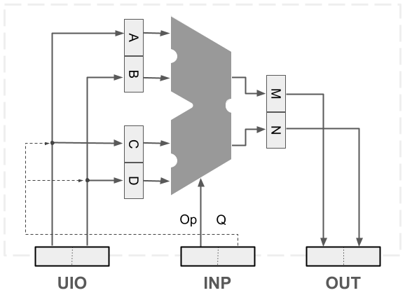

# TinySPU on TinyTapeout Technical Docs

3.13.25 (Logan Gall, Eric Shook)

We developed a TinySPU for the TinyTapeout architecture, which includes 8-bit input (INP), 8-bit output (OUT), and 8-bit input/output-swappable (UIO). We split the 8-bit INP, OUT, and UIO into two 4-bit sections, high and low. The high 4-bits of INP provide the 4-bit opcode, the low 4-bits of INP control a Q MUX to select how input data from UIO is routed to inputs A, B, C, and D. The 4-bit outputs M and N are routed to OUT high and OUT low, respectively. For more details on the TinyTapeout specs, see: https://tinytapeout.com/specs



## Hardware Structure

TinySPU is structured to function within the limitations of the TinyTapeout project spec. In general, this means:

* ~50MHz Clock rate
* 8 bits of Input (designated to OpCode & QMux)
* 8 bits of Output (designated to M and N outputs)
* 8 bits of UIO (designated to ABCD inputs)

## How to test

The verilog code can be run in HDL software of preference, with the tt_um_tinyspu.v as the top-level module.

File main.v contains a testbench of all operations programmed for the TinySPU. This can be set as a simulation source.

File DemoBench.v contains a testbench showcasing complex operations that the TinySPU can perform. This can be set as a simulation source.

## Instruction Set

The instruction set is split into two sections:
* Operation Codes -- The operation selection for the chip, set as the high 4 bits of Input
* Q Mux Codes -- The data loading multiplexer code, set as the low 4 bits of Input

## Spatial Instruction Set Architecture (SISA)

Spatial instructions/opcodes in the SISA are organized into categories to demonstrate the breadth of spatial operations available for a prototypical SPU.

### Opcode categories

| Opcode | Category |
|--------|-----------------|
| `00xx` | Control SPU Ops |
| `01xx` | Dual 4-bit Vector Ops |
| `10xx` | Dual 4-bit Raster Ops |
| `110x` | Advanced 4-bit Raster Ops |
| `111x` | Single 8-bit OUT Ops |

### 16 TinySPU Opcodes

The following 16 spatial opcodes can be used to create a multitude of spatial methods. Details of each op are included below.

| Opcode | Mnemonic | Category |
|--------|---------|-----------|
| `0000` | [NOP](#0000-nop) | Control SPU Ops |
| `0001` | [MinGate](#0001-mingate) | Control SPU Ops |
| `0010` | [EqGate](#0010-eqgate) | Control SPU Ops |
| `0011` | [ZeroMN](#0011-zeromn) | Control SPU Ops |
| `0100` | [DistDir](#0100-distdir) | Dual 4-bit Vector Ops |
| `0101` | [VectorBoxArea](#0101-vectorboxarea) | Dual 4-bit Vector Ops |
| `0110` | [BasicBuffer](#0110-basicbuffer) | Dual 4-bit Vector Ops |
| `0111` | [AttrReclass](#0111-attrreclass) | Dual 4-bit Vector Ops |
| `1000` | [FocalMeanRow](#1000-focalmeanrow) | Dual 4-bit Raster Ops |
| `1001` | [FocalSumRow](#1001-focalsumrow) | Dual 4-bit Raster Ops |
| `1010` | [LocalDiv](#1010-localdiv) | Dual 4-bit Raster Ops |
| `1011` | [FocalMaxPoolRow](#1011-focalmaxpoolrow) | Dual 4-bit Raster Ops |
| `1100` | [NormDiffIndex](#1100-normdiffindex) | Advanced 4-bit Raster Ops |
| `1101` | [LocalCodeOp](#1101-localcodeop) | Advanced 4-bit Raster Ops |
| `1110` | [MHDist8](#1110-mhdist8) | Single 8-bit OUT Ops |
| `1111` | [DotProduct](#1111-dotproduct) | Single 8-bit OUT Ops |

---

## Control SPU Ops

---

### <h3 id="0000-nop">0000 - NOP (No Operation)</h3>
**Description:**  
Does nothing. M and N remain unchanged.

M = Maintain  
N = Maintain
 
**Example:**
```
Input:  A = 3, B = 2, C = 5, D = 1  
Output: M = Maintain, N = Maintain
```

---

### <h3 id="0001-mingate">0001 - MinGate</h3>
**Description:**  
If B < D, M takes the value of A; otherwise, M takes the value of C. N stores the minimum of B and D.

M = (B < D ? A : C)  
N = min(B, D)
 
**Example:**
```
Input:  A = 7, B = 3, C = 2, D = 5  
Output: M = 7, N = 3
```

---

### <h3 id="0010-eqgate">0010 - EqGate</h3>
**Description:**  
If B equals D, then M is assigned A; otherwise, M is assigned C. N is assigned D.

M = (B == D ? A : C)  
N = D
 
**Example:**
```
Input:  A = 9, B = 5, C = 2, D = 5  
Output: M = 9, N = 5
```

---

### <h3 id="0011-zeromn">0011 - ZeroMN</h3>
**Description:**  
Sets both M and N to 0.

M = 0  
N = 0
 
**Example:**
```
Input:  A = 7, B = 3, C = 5, D = 2  
Output: M = 0, N = 0
```

---

## Dual 4-bit Vector Ops

### <h3 id="0100-distdir">0100 - DistDir</h3>
**Description:**  
Computes the Manhattan Distance for M. N represents 8-way direction with 0=North increasing clockwise.

M = |A - C| + |B - D|  
N = Direction: N=0, NE=1, E=2, SE=3, S=4, SW=5, W=6, NW=7
 
**Example:**
```
Input:  A = 6, B = 2, C = 1, D = 5  
Output: M = 8, N = 3
```

---

### <h3 id="0101-vectorboxarea">0101 - VectorBoxArea</h3>
**Description:**  
Computes the area and perimeter of a box defined by two vectors. M stores the area; N stores the perimeter.

M = |A - C| * |B - D|  
N = 2 * |A - C| + 2 * |B - D|
 
**Example:**
```
Input:  A = 5, B = 3, C = 1, D = 1  
Output: M = 8, N = 12
```

---

### <h3 id="0110-basicbuffer">0110 - BasicBuffer</h3>
**Description:**  
Buffers input values into M (X) and N (Y) for processing.

M = [A, B]  
N = [C, D]
 
**Example:**
```
Input:  A = 2, B = 3, C = 4, D = 5  
Output: M = [2 3], N = [4 5]
```

---

### <h3 id="0111-attrreclass">0111 - AttrReclass</h3>
**Description:**  
Reclassifies values into different groups.

M = [A, B, C, D]  
N = [A, C]
 
**Example:**
```
Input:  A = 1, B = 3, C = 5, D = 7  
Output: M = [1, 3, 5, 7]  
        N = [1, 5]
```

---

## Dual 4-bit Raster Ops

### <h3 id="1000-focalmeanrow">1000 - FocalMeanRow</h3>
**Description:**  
Computes the mean of three consecutive values in a row.

M = (A + B + C) / 3
N = (B + C + D) / 3 
 
**Example:**
```
Input:  A = 3, B = 6, C = 9, D = 12  
Output: M = 6, N = 9
```

---

### <h3 id="1001-focalsumrow">1001 - FocalSumRow</h3>
**Description:**  
Computes the sum of three consecutive values in a row.

M = A + B + C  
N = B + C + D
 
**Example:**
```
Input:  A = 3, B = 6, C = 9, D = 12  
Output: M = 18, N = 27
```

---

### <h3 id="1010-localdiv">1010 - LocalDiv</h3>
**Description:**  
Divides values in pairs.

M = A / C  
N = B / D
 
**Example:**
```
Input:  A = 8, B = 4, C = 2, D = 1  
Output: M = 4, N = 4
```

---

## Advanced 4-bit Raster Ops

### <h3 id="1100-normdiffindex">1100 - NormDiffIndex</h3>
**Description:**  
Computes the normalized difference index.

M = (A - C) / (A + C)  
N = (B - D) / (B + D)
 
**Example:**
```
Input:  A = 6, B = 8, C = 4, D = 2  
Output: M = 0.2, N = 0.6
```

---

### <h3 id="1101-localcodeop">1101 - LocalCodeOp</h3>
**Description:**  
Applies bitwise or arithmetic operations. 

Upper bits of D is Op1, Lower bits of D is Op2.         
00=&, 01=|, 10=+, 11=*


M = A (Op1) B  
N = (A (Op1) B) (Op2) C

**Example:**
```
Input:  A = 5, B = 3, C = 7, Op1 = &, Op2 = +  
Output: M = 1  
        N = 8
```

---

## Single 8-bit OUT Ops

### <h3 id="1110-mhdist8">1110 - MHDist8</h3>
**Description:**  
Computes the Manhattan Distance with higher precision.

M = High bits of Manhattan Distance  
N = Low bits of Manhattan Distance
 
**Example:**
```
Input:  A = 8, B = 5, C = 2, D = 1  
Output: M = High bits, N = Low bits
```

---

### <h3 id="1111-dotproduct">1111 - DotProduct</h3>
**Description:**  
Computes the dot product with sum accumulation.

M = High 4-bits of dot product  
N = Low 4-bits of dot product
 
**Example:**
```
Input:  A = 2, B = 3, C = 4, D = 5  
Output: M = High 4-bits  
        N = Low 4-bits
```


## TinySPU ISA Q Mux
### **Control Input**

**0000 NoIO**   
A/B/C/D \= Maintain Value of all INP  

**0001 ZeroCD**     
C/D     \= 0

**0010 ZeroAB**     
A/B     \= 0  

**0011 (OPEN)**

### **UIO In (01xx)**

**0100 UIOACBD**    
A/B \= UIO High  
C/D \= UIO Low

**0101 UIOCD**  
C   \= UIO High  
D   \= UIO Low  

**0110 UIOAB**  
A   \= UIO High  
B   \= UIO Low  

**0111 UIOABCD**    
A/C \= UIO High  
B/D \= UIO Low

### **MN In (10xx)**

**1000 MNACBD**     
A/B \= M  
C/D \= N  

**1001 MNCD**   
C   \= M  
D   \= N  

**1010 MNAB**   
A   \= M  
B   \= N  

**1011 MNABCD**	    
A/C \= M  
B/D \= N

### **Open for future versions**
1100 (OPEN)  
1101 (OPEN)  
1110 (OPEN)  
1111 (OPEN)
